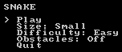
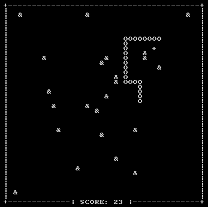

# ASCII Snake

ASCII Snake is a simple *Snake* clone written in Python.

To play the game:

    python Play.py

From here, the main menu will be shown. You can choose the size of game area,
difficulty (speed of the snake), and whether to randomly place obstacles for
each fruit eaten.

Once you start the game, collect fruits (+) and avoid obstacles (&)! The snake
will grow for each fruit you collect, and the score counter at the bottom will
keep track of how many fruits you've eaten.

It's best to set the font of your terminal/console application to have
characters that are equal in height and width, as this will ensure that the game
area is proportional.
